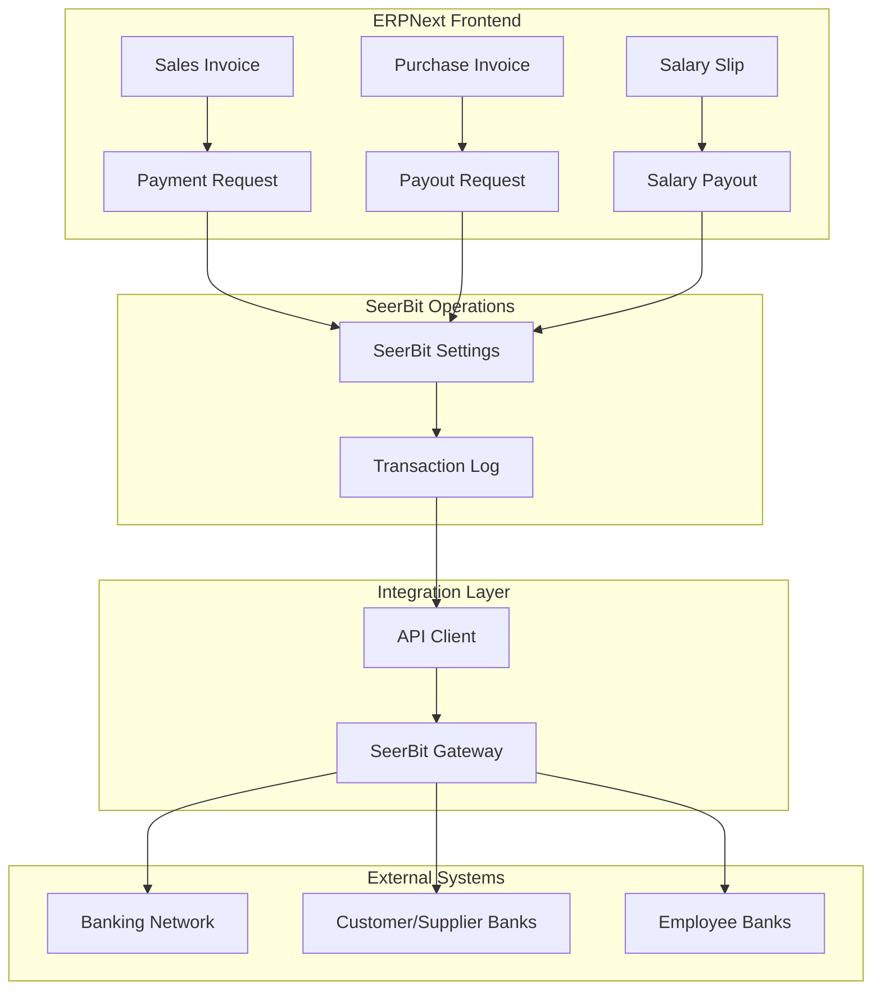
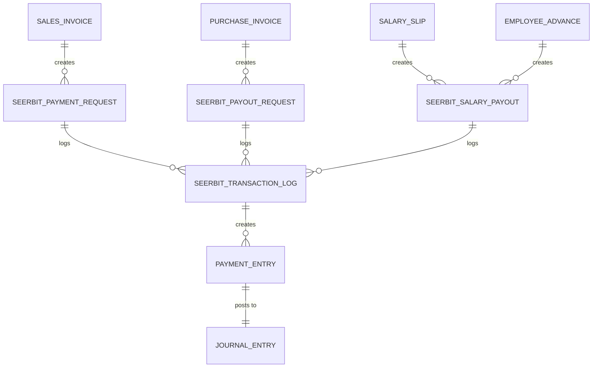
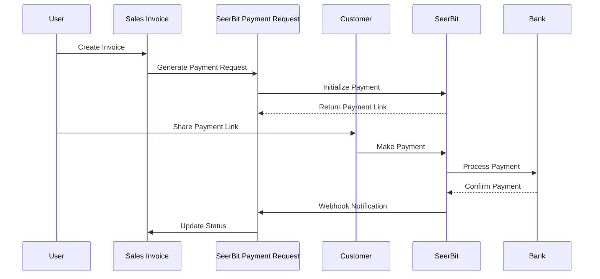
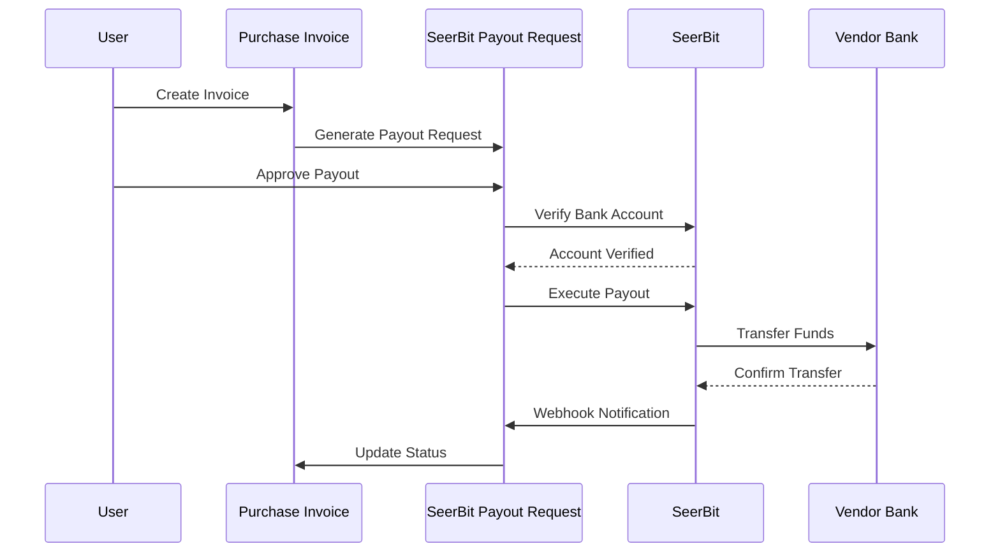
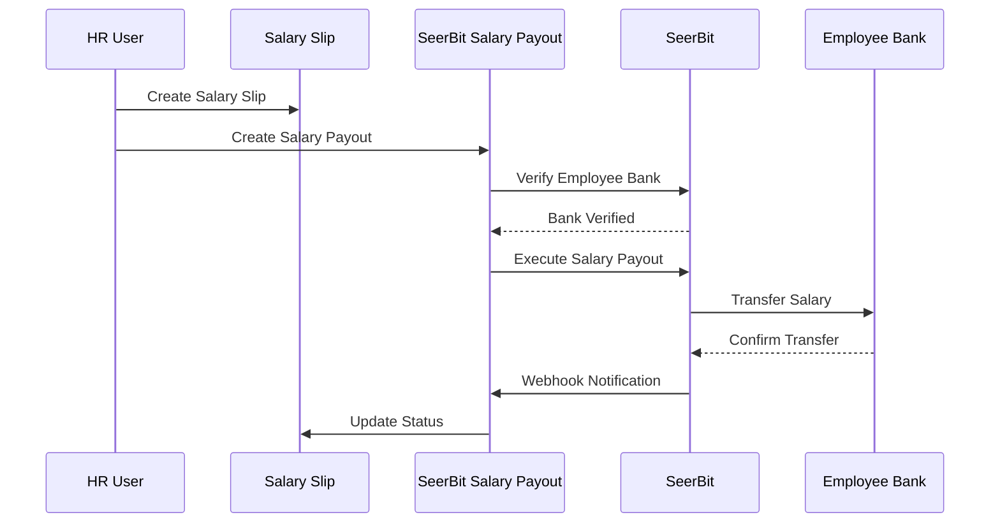

# 📋 SeerBit ERPNext Integration Documentation

> **Complete Documentation Suite for SeerBit Payment Integration with ERPNext**  
> *Covers Selling, Buying, and Employee Payment Operations*

---

## 📚 Documentation Overview

This repository contains comprehensive documentation for SeerBit integration with ERPNext, covering all payment operations from frontend user flows to technical implementation details.

### **📖 Available Guides:**

| Guide | Purpose | Audience | Duration |
|-------|---------|----------|----------|
| [🚀 Quick Start Guide](./SEERBIT_QUICK_START.md) | Get started in 15 minutes | New Users | 15 mins |
| [👤 User Guide](./SEERBIT_USER_GUIDE.md) | Complete desktop workflows | End Users | 45 mins |
| [🔧 Technical Guide](./SEERBIT_TECHNICAL_GUIDE.md) | Architecture & implementation | Developers | 60 mins |

---

## 🎯 Integration Scope

### **✅ Selling Operations (Payment Collection)**
- **Sales Invoice Payment**: Customer payment via SeerBit checkout
- **Sales Order Advance**: Advance payment collection
- **Payment Link Generation**: Shareable payment links
- **Automatic Reconciliation**: Payment status updates

### **✅ Buying Operations (Vendor Payouts)**
- **Purchase Invoice Payment**: Supplier payment processing
- **Bank Account Verification**: Automated account validation
- **Bulk Payout Processing**: Multiple vendor payments
- **Approval Workflows**: Multi-level payout approvals

### **✅ Employee Operations (Payroll & Advances)**
- **Salary Payments**: Individual and bulk salary processing
- **Employee Advances**: Staff advance payments
- **Expense Reimbursements**: Expense claim processing
- **Bank Account Management**: Employee bank detail management

### **✅ Pocket Management (Wallet Operations)**
- **Multi-Pocket Setup**: Department/project-wise wallets
- **Internal Transfers**: Funds movement between pockets
- **Balance Management**: Real-time balance tracking
- **Transaction History**: Complete audit trail

---

## 🚀 Quick Start (5 Minutes)

### **1. Installation Verification**
```bash
# Check if SeerBit integration is installed
bench --site [site-name] list-apps | grep payments
```

### **2. Access SeerBit Operations**
```
ERPNext → Home → Search "SeerBit" → SeerBit Operations
```

### **3. Basic Configuration**
```
SeerBit Settings:
✅ Public Key: SBPUBK_[your_key]
✅ Secret Key: [your_secret]
✅ Environment: Sandbox/Live
✅ Save Settings
```

### **4. Test Transaction**
```
Create Sales Invoice → Enable SeerBit Payment → Generate Payment Link → Test Payment
```

**🎉 Ready!** For detailed setup, see [Quick Start Guide](./SEERBIT_QUICK_START.md)

---

## 📊 Feature Matrix

### **Core Features Overview**

| Feature Category | Implemented | ERPNext Desktop | API Available | Tested |
|------------------|-------------|-----------------|---------------|---------|
| **Payment Collection** | ✅ | ✅ | ✅ | ✅ |
| Sales Invoice Payment | ✅ | ✅ | ✅ | ✅ |
| Sales Order Advance | ✅ | ✅ | ✅ | ✅ |
| Payment Link Generation | ✅ | ✅ | ✅ | ✅ |
| Webhook Processing | ✅ | ✅ | ✅ | ✅ |
| **Vendor Payouts** | ✅ | ✅ | ✅ | ✅ |
| Purchase Invoice Payment | ✅ | ✅ | ✅ | ✅ |
| Bank Account Verification | ✅ | ✅ | ✅ | ✅ |
| Bulk Payout Processing | ✅ | ✅ | ✅ | ✅ |
| Approval Workflows | ✅ | ✅ | ✅ | ✅ |
| **Employee Payroll** | ✅ | ✅ | ✅ | ✅ |
| Single Salary Payment | ✅ | ✅ | ✅ | ✅ |
| Bulk Salary Processing | ✅ | ✅ | ✅ | ✅ |
| Employee Advance Payment | ✅ | ✅ | ✅ | ✅ |
| Expense Reimbursement | ✅ | ✅ | ✅ | ✅ |
| **Pocket Management** | ✅ | ✅ | ✅ | ✅ |
| Multi-Pocket Setup | ✅ | ✅ | ✅ | ✅ |
| Internal Transfers | ✅ | ✅ | ✅ | ✅ |
| Balance Tracking | ✅ | ✅ | ✅ | ✅ |
| **Monitoring & Reports** | ✅ | ✅ | ✅ | ✅ |
| Transaction Logging | ✅ | ✅ | ✅ | ✅ |
| Status Dashboards | ✅ | ✅ | ✅ | ✅ |
| Financial Reports | ✅ | ✅ | ✅ | ✅ |

---

## 🏗️ Technical Architecture

### **High-Level System Design**



### **DocType Relationships**



---

## 📱 User Workflows

### **🔄 Payment Collection Workflow**



### **💸 Payout Processing Workflow**



### **👥 Salary Payment Workflow**



---

## 🛠️ Installation & Setup

### **Prerequisites**
- ERPNext v13+ or v14+
- Active SeerBit merchant account
- Valid API credentials
- HTTPS-enabled domain (for webhooks)

### **Installation Steps**
1. **Install App**: `bench get-app payments [repo-url]`
2. **Install on Site**: `bench --site [site-name] install-app payments`
3. **Run Migration**: `bench --site [site-name] migrate`
4. **Clear Cache**: `bench --site [site-name] clear-cache`

### **Configuration Steps**
1. **Access Settings**: ERPNext → SeerBit Operations → SeerBit Settings
2. **Add Credentials**: Public Key, Secret Key, Environment
3. **Set Accounts**: Default Cash, Bank, and Fee accounts
4. **Configure Webhook**: Set webhook URL and secret
5. **Test Setup**: Create test transaction

---

## 🔧 Configuration Guide

### **SeerBit Settings Configuration**

```yaml
# Core API Settings
public_key: "SBPUBK_[your_public_key]"
secret_key: "[your_secret_key]"
environment: "sandbox" # or "live"
base_url: "https://seerbitapi.com" # auto-set
webhook_secret: "[generated_secret]"

# Default Accounts
default_cash_account: "Cash - Company"
default_bank_account: "Bank - Company"
fee_account: "Bank Charges - Company"

# Currency Settings
default_currency: "NGN"
```

### **Employee Configuration**

```yaml
# Employee SeerBit Setup
seerbit_payout_enabled: true
seerbit_bank_code: "044" # Access Bank
seerbit_payout_currency: "NGN"
bank_ac_no: "0123456789" # Employee's account number
```

### **Supplier Configuration**

```yaml
# Supplier SeerBit Setup
bank_code: "044"
account_number: "0123456789"
account_name: "Supplier Company Ltd"
account_verified: true
```

---

## 📋 User Permissions

### **Role-Based Access Control**

| Role | Permissions | SeerBit Operations |
|------|-------------|-------------------|
| **Administrator** | Full access to all operations | ✅ All operations |
| **Accounts Manager** | Payment/Payout management | ✅ Create, approve, monitor |
| **HR Manager** | Employee payment operations | ✅ Salary payouts, advances |
| **Sales Manager** | Payment collection operations | ✅ Payment requests, monitoring |
| **Purchase Manager** | Vendor payout operations | ✅ Payout requests, approval |
| **Employee** | View own payment history | ✅ Read-only access |

### **Permission Setup**

```python
# Role Permission Configuration
{
    "SeerBit Payment Request": {
        "Accounts Manager": ["read", "write", "create", "submit"],
        "Sales Manager": ["read", "write", "create"],
        "Employee": ["read"]
    },
    "SeerBit Salary Payout": {
        "HR Manager": ["read", "write", "create", "submit"],
        "Accounts Manager": ["read", "write", "submit"],
        "Employee": ["read"]
    }
}
```

---

## 🧪 Testing Guide

### **Test Environment Setup**
1. **Use Sandbox**: Set environment to "sandbox" in SeerBit Settings
2. **Test Credentials**: Use SeerBit-provided test credentials
3. **Test Cards**: Use test card numbers (4111111111111111)
4. **Test Amounts**: Use small amounts for testing

### **Test Scenarios**

#### **Payment Collection Tests**
```bash
# Test 1: Basic Payment Collection
1. Create Sales Invoice for ₦1,000
2. Enable SeerBit payment
3. Generate payment link
4. Complete payment with test card
5. Verify status update and accounting entries

# Test 2: Failed Payment Handling
1. Create payment request
2. Use invalid test card
3. Verify failure handling and status update
```

#### **Payout Tests**
```bash
# Test 1: Supplier Payout
1. Setup supplier with test bank details
2. Create Purchase Invoice for ₦500
3. Create payout request
4. Verify payout execution (sandbox mode)
5. Check accounting entries

# Test 2: Salary Payout
1. Setup employee with test bank details
2. Create salary slip for ₦5,000
3. Create salary payout
4. Verify payout processing
5. Check employee records update
```

---

## 📊 Monitoring & Analytics

### **Key Metrics to Track**
- **Payment Success Rate**: % of successful payments
- **Payout Processing Time**: Average time for payout completion
- **Transaction Volume**: Daily/Monthly transaction counts
- **Error Rate**: % of failed transactions
- **Reconciliation Status**: Outstanding/pending reconciliations

### **Dashboard Widgets**
- Total Payments Collected Today
- Total Payouts Processed Today
- Pending Payment Requests
- Failed Transactions (Last 24h)
- SeerBit Pocket Balances

### **Reports Available**
- SeerBit Transaction Summary
- Employee Payout Report
- Supplier Payment Report
- Failed Transaction Analysis
- Monthly Reconciliation Report

---

## 🔍 Troubleshooting

### **Common Issues & Solutions**

| Issue | Cause | Solution |
|-------|-------|----------|
| Payment link not generated | Invalid API credentials | Check SeerBit Settings |
| Payout failed | Invalid bank details | Verify bank code and account |
| Webhook not working | URL not accessible | Check URL and SSL certificate |
| Status not updating | Webhook secret mismatch | Update webhook secret |
| Balance insufficient | Pocket balance low | Top up SeerBit pocket |

### **Debug Steps**
1. **Check Settings**: Verify SeerBit Settings configuration
2. **Review Logs**: Check SeerBit Transaction Log for errors
3. **Test Connectivity**: Verify API endpoint accessibility
4. **Validate Data**: Ensure bank details format correctness
5. **Contact Support**: Use transaction reference for support

---

## 📞 Support & Resources

### **Documentation Links**
- [Quick Start Guide](./SEERBIT_QUICK_START.md) - Get started in 15 minutes
- [User Guide](./SEERBIT_USER_GUIDE.md) - Complete desktop workflows
- [Technical Guide](./SEERBIT_TECHNICAL_GUIDE.md) - Architecture details

### **External Resources**
- [SeerBit API Documentation](https://doc.seerbit.com/)
- [ERPNext Documentation](https://docs.erpnext.com/)
- [Frappe Framework Docs](https://frappeframework.com/docs)

### **Support Channels**
- **Technical Issues**: Check SeerBit Transaction Log
- **API Problems**: Contact SeerBit API support
- **Integration Issues**: Contact ERPNext support
- **Business Issues**: Contact SeerBit merchant support

---

## 🔄 Version History

| Version | Date | Changes |
|---------|------|---------|
| 1.0.0 | Aug 2025 | Initial release with full integration |
| 1.0.1 | Aug 2025 | Added salary payout DocType |
| 1.0.2 | Aug 2025 | Enhanced custom fields and workflows |

---

## 📜 License

This integration is released under the MIT License. See LICENSE file for details.

---

## 🤝 Contributing

1. Fork the repository
2. Create feature branch (`git checkout -b feature/amazing-feature`)
3. Commit changes (`git commit -m 'Add amazing feature'`)
4. Push to branch (`git push origin feature/amazing-feature`)
5. Open a Pull Request

---

**🚀 Start processing payments with SeerBit integration for ERPNext!**

*For immediate assistance, refer to the [Quick Start Guide](./SEERBIT_QUICK_START.md) or contact your system administrator.*
