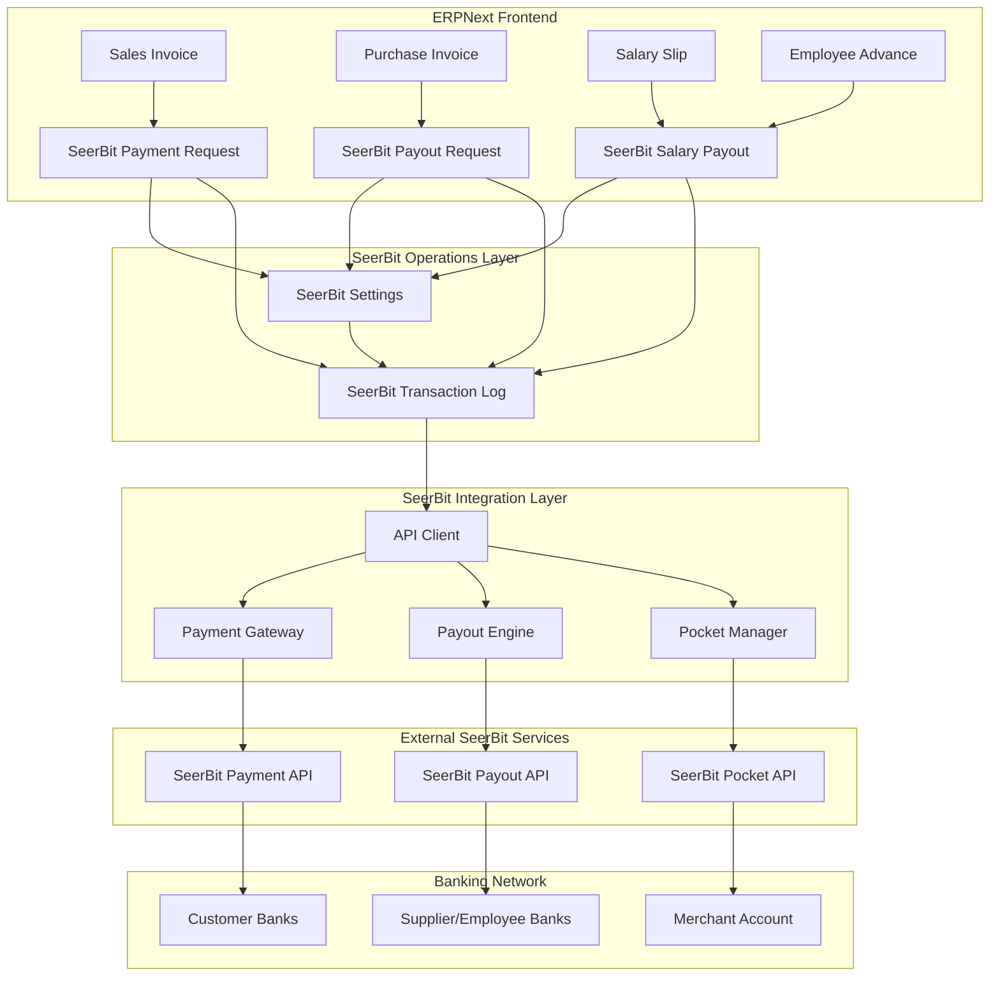
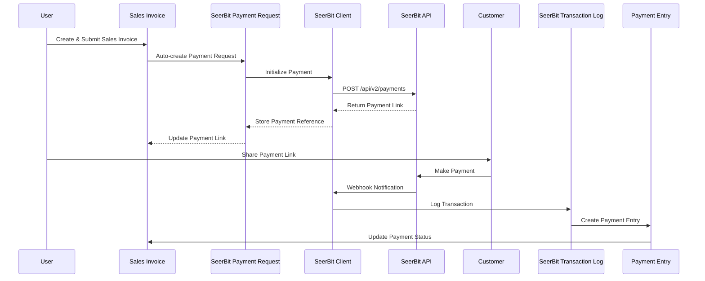
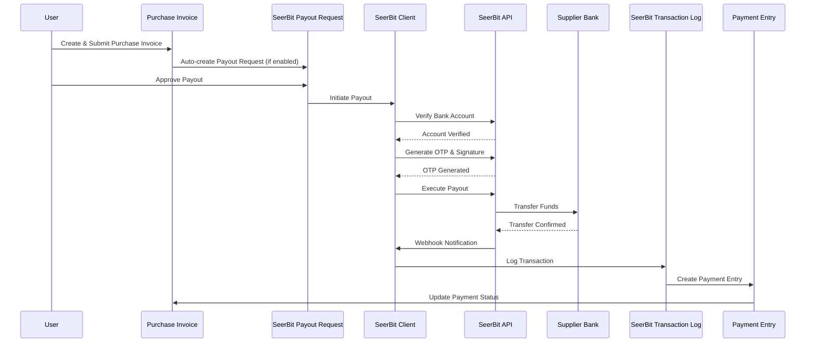
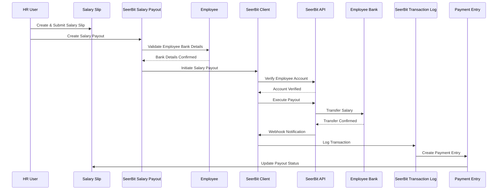
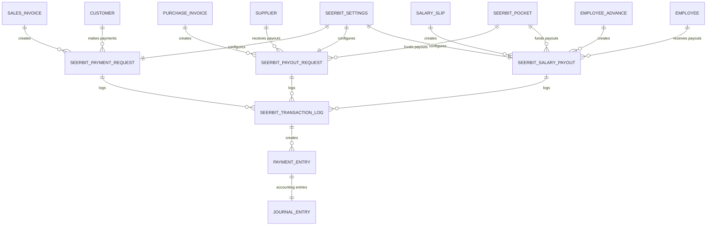
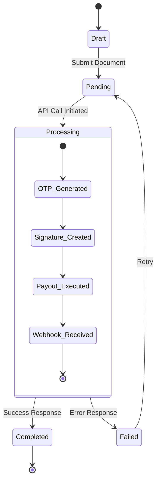

# 🔧 SeerBit Technical Implementation Guide

> **Technical Architecture and Implementation Details for SeerBit ERPNext Integration**  
> *Version 1.0 | August 2025*

---

## 📋 Table of Contents

1. [🏗️ System Architecture](#️-system-architecture)
2. [🔄 Data Flow Diagrams](#-data-flow-diagrams)
3. [⚙️ DocType Relationships](#️-doctype-relationships)
4. [🔗 API Integration Points](#-api-integration-points)
5. [📊 Database Schema](#-database-schema)
6. [🔄 Workflow Automation](#-workflow-automation)

---

## 🏗️ System Architecture

### **High-Level Architecture Overview**



### **Layer Responsibilities**

#### **1. ERPNext Frontend Layer**
- **Sales Invoice**: Customer payment collection
- **Purchase Invoice**: Supplier payment processing
- **Salary Slip**: Employee salary payments
- **Employee Advance**: Staff advance payments

#### **2. SeerBit Operations Layer**
- **SeerBit Payment Request**: Payment collection management
- **SeerBit Payout Request**: Payout processing management
- **SeerBit Salary Payout**: Payroll-specific payout handling
- **SeerBit Settings**: Configuration and credentials
- **SeerBit Transaction Log**: Audit trail and monitoring

#### **3. SeerBit Integration Layer**
- **API Client**: Communication with SeerBit services
- **Payment Gateway**: Handles incoming payments
- **Payout Engine**: Processes outgoing payments
- **Pocket Manager**: Manages wallet operations

---

## 🔄 Data Flow Diagrams

### **Payment Collection Flow (Selling)**



### **Payout Processing Flow (Buying)**



### **Salary Payout Flow (Employee)**



---

## ⚙️ DocType Relationships

### **Core DocType Relationship Diagram**



### **Field Relationships**

#### **SeerBit Payment Request**
```python
{
    "doctype": "SeerBit Payment Request",
    "links": {
        "sales_invoice": "Sales Invoice.name",
        "sales_order": "Sales Order.name",
        "customer": "Customer.name",
        "seerbit_transaction_log": "SeerBit Transaction Log.reference_document"
    },
    "auto_creation": ["Sales Invoice", "Sales Order"]
}
```

#### **SeerBit Salary Payout**
```python
{
    "doctype": "SeerBit Salary Payout",
    "links": {
        "employee": "Employee.name",
        "salary_slip": "Salary Slip.name",
        "employee_advance": "Employee Advance.name",
        "expense_claim": "Expense Claim.name",
        "seerbit_pocket": "SeerBit Pocket.name",
        "seerbit_transaction_log": "SeerBit Transaction Log.reference_document"
    },
    "auto_creation": ["Manual Creation Only"]
}
```

---

## 🔗 API Integration Points

### **SeerBit API Endpoints Used**

#### **Payment Collection APIs**
```python
# Initialize Payment
POST /api/v2/payments
{
    "publicKey": "SBPUBK_***",
    "amount": "10000.00",
    "currency": "NGN",
    "email": "customer@email.com",
    "paymentReference": "INV-2025-001",
    "callbackUrl": "https://yoursite.com/api/method/payments.webhook",
    "country": "NG"
}

# Verify Payment
GET /api/v2/payments/query/{paymentReference}
```

#### **Payout APIs**
```python
# Verify Bank Account
POST /api/v2/payments/account/verify
{
    "accountNumber": "0123456789",
    "bankCode": "044"
}

# Generate OTP for Payout
POST /pocket/payout/encrypted/otp
{
    "amount": "50000.00",
    "publicKey": "SBPUBK_***"
}

# Execute Payout
POST /pocket/payout/encrypted/pocket-id/{pocketId}
{
    "amount": "50000.00",
    "bankCode": "044",
    "accountNumber": "0123456789",
    "accountName": "John Doe",
    "reference": "SAL-2025-001",
    "otp": "123456",
    "signature": "generated_signature"
}
```

#### **Pocket Management APIs**
```python
# Get Pocket Balance
GET /pocket/balance/{pocketId}

# Transfer Between Pockets
POST /pocket/transfer
{
    "fromPocketId": "source_pocket_id",
    "toPocketId": "destination_pocket_id", 
    "amount": "10000.00",
    "reference": "Internal Transfer"
}

# Get Transaction History
GET /pocket/transactions/{pocketId}?page=1&limit=50
```

### **Webhook Handling**

#### **Payment Webhook Structure**
```python
{
    "eventType": "CARD_TRANSACTION",
    "eventData": {
        "paymentReference": "INV-2025-001",
        "amount": "10000.00",
        "currency": "NGN",
        "status": "SUCCESSFUL",
        "transactionReference": "SEERBIT_REF_123",
        "customerEmail": "customer@email.com",
        "paymentMethod": "CARD",
        "timestamp": "2025-08-13T10:30:00Z"
    }
}
```

#### **Payout Webhook Structure**
```python
{
    "eventType": "PAYOUT_TRANSACTION",
    "eventData": {
        "payoutReference": "SAL-2025-001",
        "amount": "50000.00",
        "currency": "NGN",
        "status": "SUCCESSFUL",
        "transactionReference": "SEERBIT_PAYOUT_456",
        "recipientAccount": "0123456789",
        "bankCode": "044",
        "timestamp": "2025-08-13T15:45:00Z"
    }
}
```

---

## 📊 Database Schema

### **Core Tables Structure**

#### **tabSeerBit Payment Request**
```sql
CREATE TABLE `tabSeerBit Payment Request` (
    `name` varchar(140) PRIMARY KEY,
    `creation` datetime(6),
    `modified` datetime(6),
    `modified_by` varchar(140),
    `owner` varchar(140),
    `docstatus` int(1) DEFAULT 0,
    
    -- Reference Documents
    `sales_invoice` varchar(140),
    `sales_order` varchar(140),
    `customer` varchar(140),
    
    -- Payment Details
    `amount` decimal(18,6),
    `currency` varchar(3) DEFAULT 'NGN',
    `payment_reference` varchar(140),
    `payment_link` longtext,
    `status` varchar(50) DEFAULT 'Draft',
    
    -- SeerBit Details
    `seerbit_reference` varchar(140),
    `transaction_id` varchar(140),
    `payment_method` varchar(50),
    
    -- Tracking
    `payment_date` datetime(6),
    `webhook_received` int(1) DEFAULT 0,
    
    KEY `sales_invoice` (`sales_invoice`),
    KEY `customer` (`customer`),
    KEY `status` (`status`),
    KEY `payment_reference` (`payment_reference`)
);
```

#### **tabSeerBit Salary Payout**
```sql
CREATE TABLE `tabSeerBit Salary Payout` (
    `name` varchar(140) PRIMARY KEY,
    `creation` datetime(6),
    `modified` datetime(6),
    `modified_by` varchar(140),
    `owner` varchar(140),
    `docstatus` int(1) DEFAULT 0,
    
    -- Payout Type and References
    `payout_type` varchar(50),
    `employee` varchar(140),
    `salary_slip` varchar(140),
    `employee_advance` varchar(140),
    `expense_claim` varchar(140),
    
    -- Bank Details
    `bank_code` varchar(10),
    `account_number` varchar(20),
    `account_name` varchar(140),
    `bank_name` varchar(140),
    
    -- Payout Details
    `amount` decimal(18,6),
    `currency` varchar(3) DEFAULT 'NGN',
    `payout_reference` varchar(140),
    `status` varchar(50) DEFAULT 'Draft',
    
    -- SeerBit Details
    `pocket_id` varchar(140),
    `transaction_id` varchar(140),
    `otp_generated` int(1) DEFAULT 0,
    `signature` longtext,
    
    -- Accounting
    `payment_entry` varchar(140),
    `journal_entry` varchar(140),
    
    -- Tracking
    `payout_date` datetime(6),
    `webhook_received` int(1) DEFAULT 0,
    
    KEY `employee` (`employee`),
    KEY `salary_slip` (`salary_slip`),
    KEY `status` (`status`),
    KEY `payout_reference` (`payout_reference`)
);
```

#### **tabSeerBit Transaction Log**
```sql
CREATE TABLE `tabSeerBit Transaction Log` (
    `name` varchar(140) PRIMARY KEY,
    `creation` datetime(6),
    `modified` datetime(6),
    
    -- Transaction Details
    `transaction_type` varchar(50), -- Payment/Payout
    `reference_doctype` varchar(140),
    `reference_document` varchar(140),
    `transaction_reference` varchar(140),
    `seerbit_reference` varchar(140),
    
    -- Financial Details
    `amount` decimal(18,6),
    `currency` varchar(3),
    `status` varchar(50),
    
    -- API Details
    `api_endpoint` varchar(200),
    `request_data` longtext,
    `response_data` longtext,
    `webhook_data` longtext,
    
    -- Status Tracking
    `processed_at` datetime(6),
    `webhook_received_at` datetime(6),
    `error_message` longtext,
    
    KEY `transaction_type` (`transaction_type`),
    KEY `reference_document` (`reference_document`),
    KEY `status` (`status`),
    KEY `seerbit_reference` (`seerbit_reference`)
);
```

### **Custom Fields Schema**

#### **Employee Custom Fields**
```sql
-- Added to tabEmployee
ALTER TABLE `tabEmployee` ADD COLUMN `seerbit_payout_enabled` int(1) DEFAULT 0;
ALTER TABLE `tabEmployee` ADD COLUMN `seerbit_bank_code` varchar(10);
ALTER TABLE `tabEmployee` ADD COLUMN `seerbit_payout_currency` varchar(3) DEFAULT 'NGN';
ALTER TABLE `tabEmployee` ADD COLUMN `seerbit_last_payout_date` date;
ALTER TABLE `tabEmployee` ADD COLUMN `seerbit_total_payouts` decimal(18,6) DEFAULT 0;
```

#### **Salary Slip Custom Fields**
```sql
-- Added to tabSalary Slip
ALTER TABLE `tabSalary Slip` ADD COLUMN `seerbit_payout_enabled` int(1) DEFAULT 0;
ALTER TABLE `tabSalary Slip` ADD COLUMN `seerbit_payout_reference` varchar(140);
ALTER TABLE `tabSalary Slip` ADD COLUMN `seerbit_payout_status` varchar(50) DEFAULT 'Not Initiated';
ALTER TABLE `tabSalary Slip` ADD COLUMN `seerbit_transaction_id` varchar(140);
ALTER TABLE `tabSalary Slip` ADD COLUMN `seerbit_payout_date` datetime(6);
```

---

## 🔄 Workflow Automation

### **Automated Workflow Triggers**

#### **Sales Invoice Workflow**
```python
# hooks.py
doc_events = {
    "Sales Invoice": {
        "on_submit": "payments.seerbit_operations.utils.create_payment_request_if_enabled",
        "on_payment_received": "payments.seerbit_operations.utils.update_seerbit_payment_status"
    }
}

# Auto-creation logic
def create_payment_request_if_enabled(doc, method):
    if doc.enable_seerbit_payment:
        from payments.seerbit_operations.doctype.seerbit_payment_request.seerbit_payment_request import create_from_sales_invoice
        create_from_sales_invoice(doc.name)
```

#### **Purchase Invoice Workflow**
```python
# Auto-payout creation
doc_events = {
    "Purchase Invoice": {
        "on_submit": "payments.seerbit_operations.utils.create_payout_request_if_enabled"
    }
}

def create_payout_request_if_enabled(doc, method):
    if doc.enable_seerbit_payout and doc.auto_create_payout:
        from payments.seerbit_operations.doctype.seerbit_payout_request.seerbit_payout_request import create_from_purchase_invoice
        create_from_purchase_invoice(doc.name)
```

#### **Employee Workflow**
```python
# Employee bank verification
doc_events = {
    "Employee": {
        "validate": "payments.seerbit_operations.utils.validate_employee_bank_details",
        "on_update": "payments.seerbit_operations.utils.verify_bank_account_if_changed"
    }
}
```

### **Background Job Processing**

#### **Bulk Salary Processing**
```python
from frappe import enqueue

def process_bulk_salary_payouts(salary_slips):
    """Process multiple salary payouts in background"""
    for salary_slip in salary_slips:
        enqueue(
            'payments.seerbit_integration.payroll.salary_payments.initiate_salary_payout',
            queue='long',
            timeout=300,
            salary_slip_id=salary_slip,
            is_async=True
        )
```

#### **Webhook Processing**
```python
def handle_webhook_async(webhook_data):
    """Process webhook in background to avoid timeout"""
    enqueue(
        'payments.seerbit_integration.webhook.process_webhook_data',
        queue='short',
        timeout=60,
        webhook_data=webhook_data,
        is_async=True
    )
```

### **Scheduled Jobs**

#### **Cron Jobs for Status Updates**
```python
# hooks.py
scheduler_events = {
    "cron": {
        "0 */6 * * *": [  # Every 6 hours
            "payments.seerbit_operations.utils.sync_pending_transactions"
        ],
        "0 2 * * *": [    # Daily at 2 AM
            "payments.seerbit_operations.utils.reconcile_seerbit_transactions"
        ],
        "0 0 1 * *": [    # Monthly on 1st
            "payments.seerbit_operations.utils.generate_monthly_reports"
        ]
    }
}
```

### **State Machine for Transaction Status**



### **Error Handling and Retry Logic**

#### **Exponential Backoff for API Calls**
```python
import time
from functools import wraps

def retry_with_backoff(max_retries=3, base_delay=1):
    def decorator(func):
        @wraps(func)
        def wrapper(*args, **kwargs):
            for attempt in range(max_retries):
                try:
                    return func(*args, **kwargs)
                except Exception as e:
                    if attempt == max_retries - 1:
                        raise e
                    delay = base_delay * (2 ** attempt)
                    frappe.log_error(f"Attempt {attempt + 1} failed: {str(e)}")
                    time.sleep(delay)
            return None
        return wrapper
    return decorator

@retry_with_backoff(max_retries=3, base_delay=2)
def call_seerbit_api(endpoint, data):
    # API call implementation
    pass
```

---

## 🎯 Performance Considerations

### **Database Indexing Strategy**
```sql
-- Optimize frequent queries
CREATE INDEX idx_seerbit_payment_status ON `tabSeerBit Payment Request` (`status`, `creation`);
CREATE INDEX idx_seerbit_payout_employee ON `tabSeerBit Salary Payout` (`employee`, `payout_date`);
CREATE INDEX idx_transaction_log_reference ON `tabSeerBit Transaction Log` (`reference_document`, `transaction_type`);
```

### **Caching Strategy**
```python
# Cache SeerBit settings
@frappe.whitelist()
def get_seerbit_settings():
    return frappe.cache().get_value("seerbit_settings") or frappe.get_doc("SeerBit Settings")

# Cache exchange rates
def get_exchange_rate(from_currency, to_currency):
    cache_key = f"exchange_rate_{from_currency}_{to_currency}"
    return frappe.cache().get_value(cache_key, expires_in_sec=3600)
```

### **Rate Limiting**
```python
from frappe.rate_limiter import rate_limit

@rate_limit(limit=100, window=3600)  # 100 requests per hour
def create_seerbit_payment_request():
    # Implementation
    pass
```

---

*📚 This technical guide provides the detailed implementation architecture for SeerBit integration with ERPNext. For user-facing documentation, refer to the main User Guide.*
