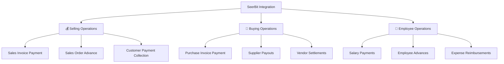
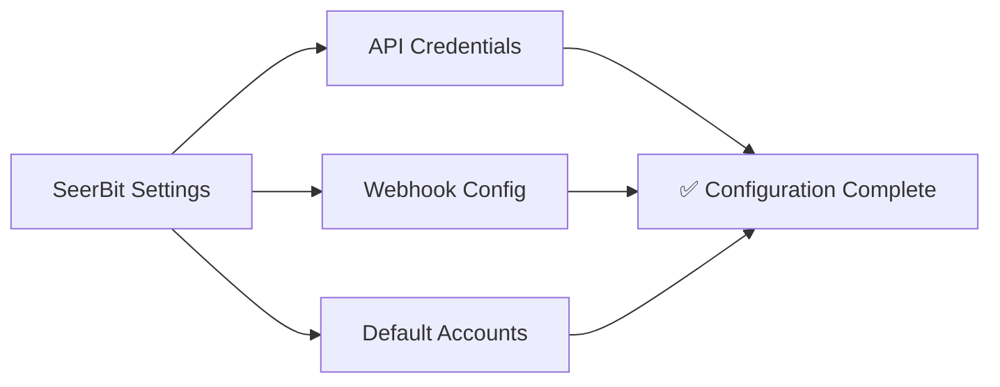
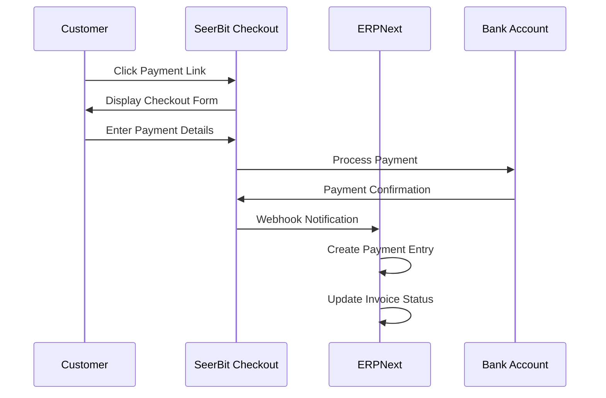
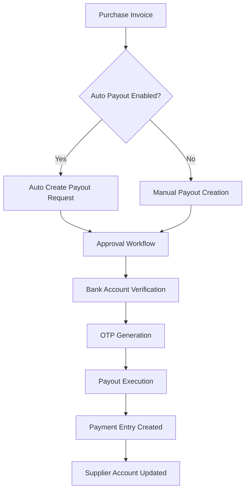
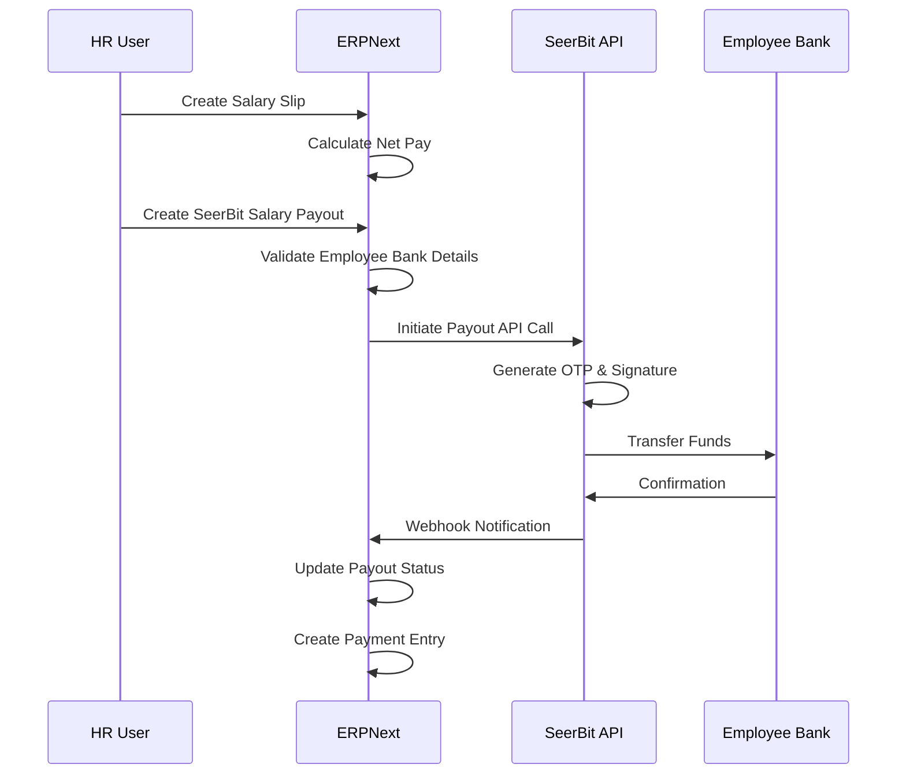
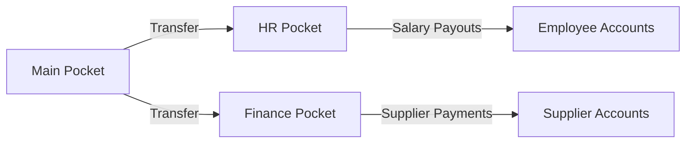

# 🧾 SeerBit Integration User Guide for ERPNext

> **Complete Desktop User Flow Documentation for SeerBit Operations**  
> *Version 1.0 | August 2025*

---

## 📋 Table of Contents

1. [🎯 Overview](#-overview)
2. [⚙️ Initial Setup](#️-initial-setup)
3. [💰 Selling Operations](#-selling-operations-payment-collection)
4. [💸 Buying Operations](#-buying-operations-payouts)
5. [👥 Employee Operations](#-employee-operations-payrolladvances)
6. [🏦 Pocket Management](#-pocket-management)
7. [📊 Monitoring & Reports](#-monitoring--reports)
8. [🔧 Troubleshooting](#-troubleshooting)

---

## 🎯 Overview

SeerBit integration with ERPNext provides seamless payment processing across three core business operations:



### **🔧 Core Features:**
- ✅ **Payment Collection** via SeerBit checkout links
- ✅ **Automated Payouts** to suppliers and employees
- ✅ **Pocket Management** for departmental wallets
- ✅ **Real-time Status Tracking** and audit trails
- ✅ **Automated Accounting** entries and reconciliation

---

## ⚙️ Initial Setup

### **Step 1: Configure SeerBit Settings**

1. **Navigate to SeerBit Operations**
   ```
   Home → SeerBit Operations → SeerBit Settings
   ```

2. **Enter API Credentials**
   - **Public Key**: Your SeerBit public key
   - **Secret Key**: Your SeerBit secret key (encrypted)
   - **Environment**: Select `Sandbox` for testing, `Live` for production
   - **Base URL**: Auto-populated based on environment

3. **Configure Webhook Settings**
   - **Webhook URL**: `https://your-site.com/api/method/payments.seerbit_integration.webhook.handle_webhook`
   - **Webhook Secret**: Generate and save webhook secret

4. **Set Default Accounts**
   - **Default Cash Account**: Select cash account for payments
   - **Default Bank Account**: Select bank account for payouts
   - **Fee Account**: Account for transaction fees

5. **Save Configuration**



---

## 💰 Selling Operations (Payment Collection)

### **Flow 1: Sales Invoice Payment Collection**

#### **Step 1: Create Sales Invoice**
1. **Navigate to Sales Invoice**
   ```
   Home → Selling → Sales Invoice → New
   ```

2. **Fill Invoice Details**
   - Select Customer
   - Add Items and Quantities
   - Set Pricing and Taxes
   - **Enable SeerBit Payment**: Check ✅ "Enable SeerBit Payment"

3. **Submit Invoice**

#### **Step 2: Generate Payment Link**
1. **After Submission**
   - Click **"Create SeerBit Payment Link"** button
   - System auto-creates **SeerBit Payment Request**
   - Payment link appears in **"Payment Link"** field

2. **Share Payment Link**
   - Copy payment link from invoice
   - Share via email/SMS to customer
   - Customer clicks link → redirected to SeerBit checkout

#### **Step 3: Payment Processing**


#### **Step 4: Monitor Payment Status**
1. **Check Invoice Status**
   - Payment Status updates automatically
   - **"Paid"** when payment successful
   - **"Failed"** if payment unsuccessful

2. **View Payment Entry**
   - Auto-created Payment Entry links invoice to payment
   - Accounting entries posted automatically

### **Flow 2: Sales Order Advance Payment**

1. **Create Sales Order**
   ```
   Home → Selling → Sales Order → New
   ```

2. **Configure Advance Payment**
   - Check ✅ "Enable SeerBit Payment"
   - Set **"Advance Payment Amount"**
   - Submit Sales Order

3. **Generate Advance Payment Link**
   - Click **"Create Advance Payment Link"**
   - Share link with customer for advance payment

---

## 💸 Buying Operations (Payouts)

### **Flow 1: Supplier Payment via SeerBit**

#### **Step 1: Configure Supplier Bank Details**
1. **Open Supplier Record**
   ```
   Home → Buying → Supplier → [Select Supplier]
   ```

2. **Add SeerBit Bank Details**
   - Go to **"SeerBit Bank Details"** section
   - Enter **Bank Code** (e.g., 044 for Access Bank)
   - Enter **Account Number**
   - Enter **Account Name**
   - Click **"Verify Account"** to validate

#### **Step 2: Create Purchase Invoice**
1. **Navigate to Purchase Invoice**
   ```
   Home → Buying → Purchase Invoice → New
   ```

2. **Configure SeerBit Payout**
   - Select Supplier (with verified bank details)
   - Add Items and set amounts
   - Check ✅ "Enable SeerBit Payout"
   - Optionally check ✅ "Auto Create Payout Request"
   - Submit Invoice

#### **Step 3: Process Payout**
1. **Manual Payout Creation**
   ```
   Home → SeerBit Operations → SeerBit Payout Request → New
   ```
   - Select Purchase Invoice
   - Verify supplier bank details
   - Set payout amount
   - Submit to initiate payout

2. **Automated Payout** (if enabled)
   - System auto-creates payout request on invoice submission
   - Payout processed based on approval workflow



---

## 👥 Employee Operations (Payroll/Advances)

### **Flow 1: Employee Salary Payment Setup**

#### **Step 1: Configure Employee for SeerBit**
1. **Open Employee Record**
   ```
   Home → Human Resources → Employee → [Select Employee]
   ```

2. **Setup SeerBit Configuration**
   - Go to **"SeerBit Payment Configuration"** section
   - Check ✅ "Enable SeerBit Payouts"
   - Enter **SeerBit Bank Code** (e.g., 044)
   - Set **Default Payout Currency** (NGN)
   - Save employee record

#### **Step 2: Process Salary Slip**
1. **Create Salary Slip**
   ```
   Home → Payroll → Salary Slip → New
   ```
   - Select Employee (SeerBit enabled)
   - Generate salary components
   - Check ✅ "Process via SeerBit" in SeerBit section
   - Submit salary slip

2. **Create SeerBit Salary Payout**
   ```
   Home → SeerBit Operations → SeerBit Salary Payout → New
   ```
   - **Payout Type**: Select "Salary"
   - **Employee**: Select employee
   - **Salary Slip**: Link to salary slip
   - **Bank Details**: Auto-populated from employee
   - **Amount**: Auto-filled from salary slip net pay
   - Submit to initiate payout



### **Flow 2: Employee Advance Payment**

#### **Step 1: Create Employee Advance**
1. **Navigate to Employee Advance**
   ```
   Home → Human Resources → Employee Advance → New
   ```

2. **Configure Advance**
   - Select Employee (SeerBit enabled)
   - Enter advance amount and purpose
   - Check ✅ "Process via SeerBit"
   - Submit advance request

#### **Step 2: Process Advance Payout**
1. **Create SeerBit Salary Payout**
   ```
   Home → SeerBit Operations → SeerBit Salary Payout → New
   ```
   - **Payout Type**: Select "Employee Advance"
   - **Employee**: Select employee
   - **Employee Advance**: Link to advance request
   - **Amount**: Set advance amount
   - Submit to process payout

### **Flow 3: Bulk Salary Processing**

1. **Create Multiple Salary Slips**
   ```
   Home → Payroll → Process Payroll → Generate Salary Slips
   ```

2. **Bulk Payout Creation**
   ```
   Home → SeerBit Operations → SeerBit Salary Payout → List View
   ```
   - Click **"Bulk Actions"** → **"Create Bulk Payouts"**
   - Select multiple submitted salary slips
   - System creates individual payout records
   - Process payouts in batch

---

## 🏦 Pocket Management

### **Step 1: Create Main Pocket**
1. **Navigate to SeerBit Pocket**
   ```
   Home → SeerBit Operations → SeerBit Pocket → New
   ```

2. **Configure Pocket**
   - **Pocket Name**: "Main Operations Wallet"
   - **Pocket Type**: "Main"
   - **Currency**: NGN
   - **Department**: Select department (optional)
   - Submit to create

### **Step 2: Create Sub-Pockets**
1. **Department-based Pockets**
   - Create pockets for HR, Finance, Operations
   - Link to respective departments
   - Set spending limits and controls

2. **Project-based Pockets**
   - Create pockets for specific projects
   - Allocate budgets from main pocket
   - Track project-specific expenses

### **Step 3: Pocket Operations**

#### **Internal Transfers**


#### **Balance Management**
1. **Check Pocket Balance**
   ```
   Home → SeerBit Operations → SeerBit Pocket → [Select Pocket]
   ```
   - View current balance
   - Check transaction history
   - Monitor spending patterns

2. **Transfer Between Pockets**
   - Use **"Internal Transfer"** button
   - Select source and destination pockets
   - Enter transfer amount and purpose
   - Submit transfer

---

## 📊 Monitoring & Reports

### **Transaction Monitoring**

#### **SeerBit Transaction Log**
```
Home → SeerBit Operations → SeerBit Transaction Log
```

**Key Information:**
- Transaction Reference
- Transaction Type (Payment/Payout)
- Status (Pending/Completed/Failed)
- Amount and Currency
- Related Document (Invoice/Salary Slip/etc.)
- Timestamp and User

#### **Payment Status Dashboard**
1. **Sales Payment Tracking**
   - Pending payment requests
   - Successful collections
   - Failed transactions
   - Revenue analytics

2. **Payout Status Tracking**
   - Pending supplier payouts
   - Completed salary payments
   - Failed transactions
   - Expense analytics

### **Financial Reports**

#### **SeerBit Payment Summary**
```sql
-- Sample report query for payment summary
SELECT 
    DATE(creation) as date,
    transaction_type,
    SUM(amount) as total_amount,
    COUNT(*) as transaction_count,
    status
FROM `tabSeerBit Transaction Log` 
WHERE creation >= '2025-08-01'
GROUP BY DATE(creation), transaction_type, status
ORDER BY date DESC
```

#### **Employee Payout Report**
```
Home → Human Resources → Reports → Employee Payout Summary
```
- Employee-wise payout totals
- Monthly salary payment tracking
- Advance payment monitoring
- Outstanding advance balances

---

## 🔧 Troubleshooting

### **Common Issues & Solutions**

#### **Issue 1: Payment Link Not Generated**
**Symptoms:**
- "Create Payment Link" button not working
- Payment Request not created

**Solution:**
1. Check SeerBit Settings configuration
2. Verify API credentials
3. Ensure internet connectivity
4. Check error logs in SeerBit Transaction Log

#### **Issue 2: Payout Failed**
**Symptoms:**
- Payout status shows "Failed"
- Money not transferred to recipient

**Solution:**
1. **Verify Bank Details**
   - Check bank code accuracy
   - Verify account number
   - Confirm account name matches

2. **Check SeerBit Account**
   - Sufficient wallet balance
   - Account status active
   - No restrictions on payouts

3. **Review Transaction Log**
   - Check error message
   - Verify OTP generation
   - Confirm signature validity

#### **Issue 3: Webhook Not Working**
**Symptoms:**
- Payment status not updating
- Manual status refresh required

**Solution:**
1. **Verify Webhook URL**
   ```
   https://your-site.com/api/method/payments.seerbit_integration.webhook.handle_webhook
   ```

2. **Check Webhook Secret**
   - Must match SeerBit dashboard
   - Properly configured in SeerBit Settings

3. **Test Webhook Endpoint**
   ```bash
   curl -X POST https://your-site.com/api/method/payments.seerbit_integration.webhook.handle_webhook \
   -H "Content-Type: application/json" \
   -d '{"test": "webhook"}'
   ```

### **Error Code Reference**

| Error Code | Description | Solution |
|------------|-------------|----------|
| `INSUFFICIENT_BALANCE` | Pocket balance too low | Top up pocket balance |
| `INVALID_BANK_CODE` | Bank code not recognized | Use correct Nigerian bank code |
| `ACCOUNT_NOT_FOUND` | Bank account doesn't exist | Verify account number |
| `INVALID_SIGNATURE` | Authentication failed | Check API credentials |
| `WEBHOOK_TIMEOUT` | Webhook response timeout | Check server connectivity |

### **Contact Support**

For technical issues:
1. **Check SeerBit Transaction Log** for error details
2. **Review Frappe Error Log** for system errors
3. **Contact SeerBit Support** for API-related issues
4. **Contact ERPNext Support** for integration issues

---

## 📝 Best Practices

### **Security Recommendations**
- ✅ Use strong API credentials
- ✅ Enable two-factor authentication
- ✅ Regular credential rotation
- ✅ Monitor transaction logs daily
- ✅ Set appropriate user permissions

### **Operational Guidelines**
- ✅ Verify bank details before payouts
- ✅ Test with small amounts first
- ✅ Maintain adequate pocket balances
- ✅ Regular reconciliation of accounts
- ✅ Backup transaction data regularly

### **Performance Optimization**
- ✅ Use bulk operations for salary processing
- ✅ Schedule payout batches during off-peak hours
- ✅ Monitor API rate limits
- ✅ Cache frequently accessed data
- ✅ Regular database maintenance

---

## 🎯 Quick Reference

### **Navigation Shortcuts**
| Operation | Path |
|-----------|------|
| SeerBit Settings | `Home → SeerBit Operations → SeerBit Settings` |
| Payment Requests | `Home → SeerBit Operations → SeerBit Payment Request` |
| Payout Requests | `Home → SeerBit Operations → SeerBit Payout Request` |
| Salary Payouts | `Home → SeerBit Operations → SeerBit Salary Payout` |
| Transaction Log | `Home → SeerBit Operations → SeerBit Transaction Log` |
| Pocket Management | `Home → SeerBit Operations → SeerBit Pocket` |

### **Key Roles & Permissions**
| Role | Permissions |
|------|-------------|
| **Manager** | Full access to all SeerBit operations |
| **Account Officer** | Create and verify payment/payout requests |
| **HR Manager** | Salary payouts and employee advances |
| **Sales User** | Create payment requests for sales |
| **Purchase User** | Create payout requests for purchases |

---

*📧 For questions or support, contact your system administrator or refer to the ERPNext documentation.*

**🚀 Happy Processing with SeerBit Integration!**
